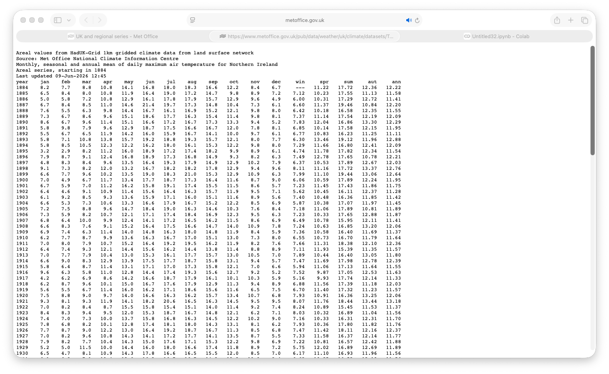
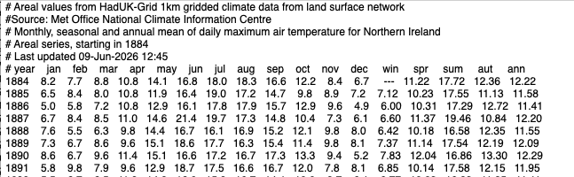
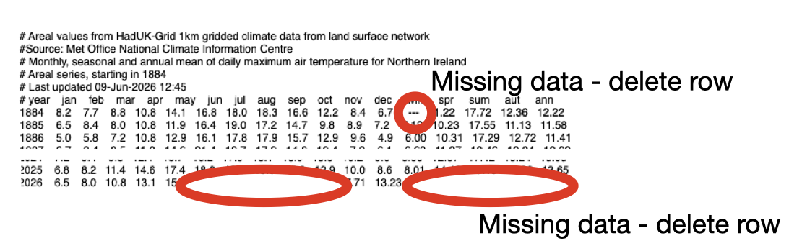
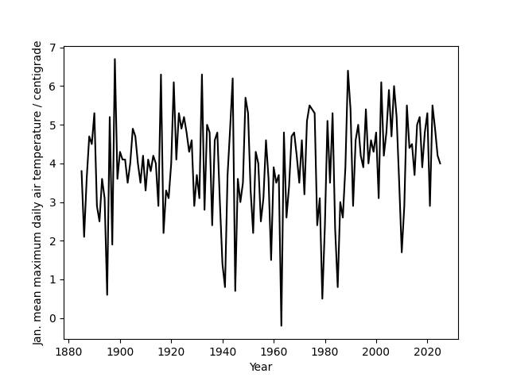

# Aim

I want you to construct a figure for your presentation that illustrates that the climate in Northern Ireland is changing.

# Instructions

Look at [this historical data](https://www.metoffice.gov.uk/research/climate/maps-and-data/uk-and-regional-series) on the climate in Northern Ireland. Select Northern Ireland as the region and the Year ordered statstics checkbox and then pick any parameter that interests you.  When you press the download button a file that looks like this should open in your browser:



You can copy and paste the contents of this file into a notebook file and edit it slighly by putting a # infront of the first few lines as shown below:



You can then save it and upload it to [google colab](https://colab.research.google.com) by clicking the following buttons:


If your file is uploaded to colab in a file called `data.txt` you should then be able to load the data into a numpy array by using the following Python commands:

```python
import matplotlib.pyplot as plt
import numpy as np

data = np.loadtxt("data.txt")
```

If this command returns an error you will need to check for missing data in the input file. Missing data will either be indicated using a blank space in one of the columns or a - in one of the columns shown below.  



If you delete any rows that contain missing data from the file on your computer and reupload the editted file to colab the `np.loadtxt` command should then work. 

One the data it loaded we can construct a graph that shows the data in the first column of the data file against the data in the second column by using the following commands:

```python
plt.plot( data[:,0], data[:,1], 'k-' )
# Please clearly label the axes in your graph and include units
# If you don't do this then your graph tells us nothing.
plt.xlabel("Year")
plt.ylabel("Jan. mean maximum daily air temperature / centigrade")
# By using the savefig command here we create a png file called
# myfigure.png that we can download from colab and put in the slides
# for the presentation.
plt.savefig("myfigure.png") 
```

The graph I constructed using these commands is shown in the figure below. I don't think this graph provides any evidence that the climate in Northern Ireland is changing. However, that __does not__ mean that climate change is not occuring.  It means that the phenomenon of climate change is not affecting the particular variable that I am plotting here.


