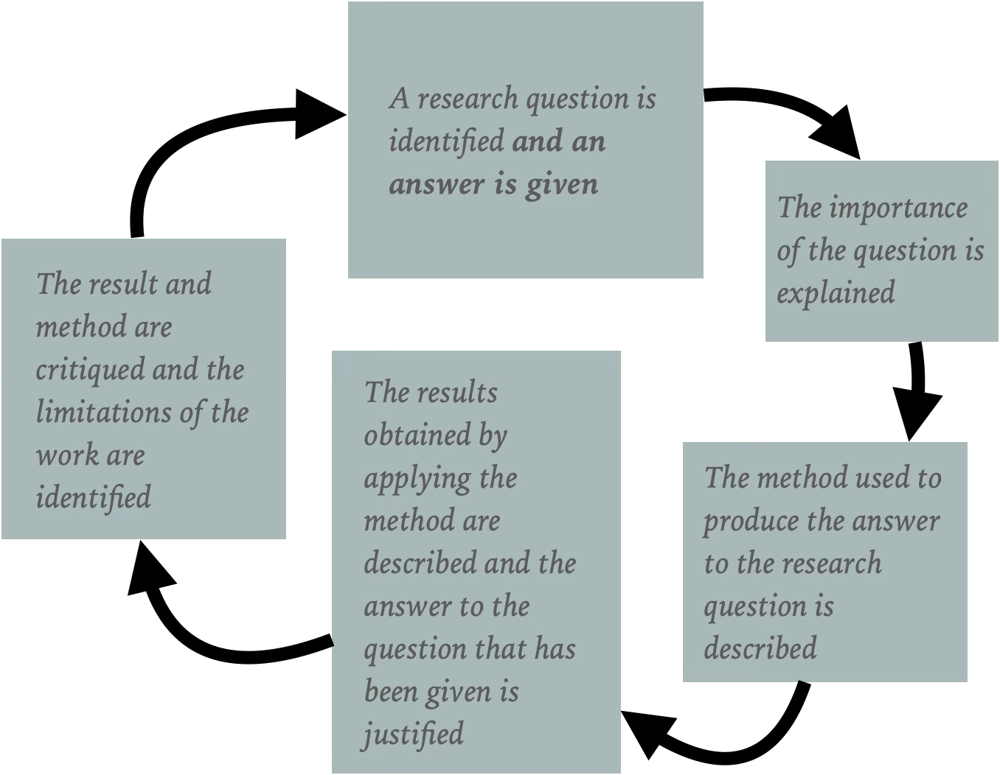

The first activity has demonstrated that we can demonstrate that the climate is chaning by doing experiments and collecting data. However, doing these activities by themselves does not allow us to understand __why__ the climate is changing. To understand __why__ an observable feature of the universe is changing we need a model. Furthermore, this statement is as true for physicists and chemists as it is for mathematicians. This business of constructing models that explain our experimental observations is the central activity of scientific research.  Furthermore, if we want models that make quantitivative predictions we will need to use mathematics in their construction. In the second part of your presentation I thus want you to present some modelling work that you have done today.

The figure below illustrates how I set about presenting a piece of research.  You can use it to guide you as you prepare the modelling parts of your presentation.

You will find [an example](egproject.pdf) of a piece of modelling work on the atmosphere here. The colab notebook that I used to construct the figures in this notebook can be found [here](https://colab.research.google.com/drive/1kcQ-8dQRIanInDfQiwDAu7VjAvWWfPU_?usp=sharing).  The research question that I have asked here is whether I can reproduce the  temperature profile in the atomsphere using a two-level model of the atmosphere. Furthermore, you can also see that I have found that such models do not reproduce the observed temperature profile in the atomsphere.

I used the resources that you can find [here](https://brian-rose.github.io/ClimateLaboratoryBook/) to write this report. What I would like you to do during the remainder of the session is to read those resources and try to identify a research question that you answer from your readings.  I then want you to present what your group found out during your presentation.  I will discuss what you are reading with you during the day.  In other words, I will be there to help you all day.  However, you are the ones who are driving this particular piece of research.
